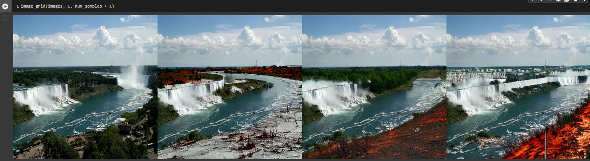
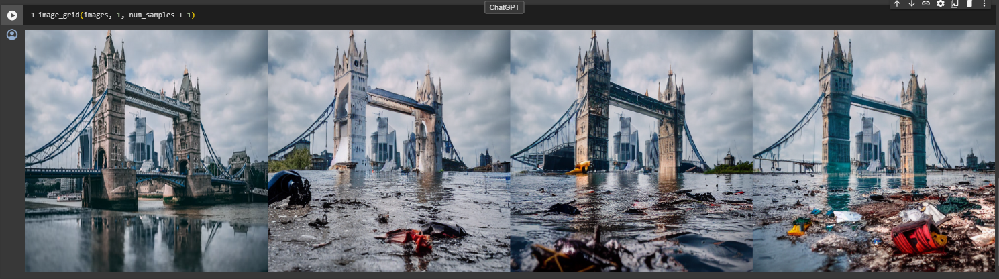
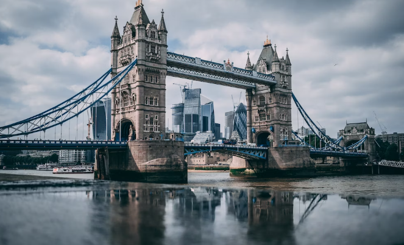

# Disaster_Simulacra
 
Experience the urgent reality of climate change on your doorstep by uploading a picture of your home, as generative AI transforms familiar scenes into powerful visual narratives, fostering empathy and motivating a global call to action for climate mitigation efforts, while concurrently serving as a transformative aid for architects and engineers in risk assessment, construction prioritization, and creative retrofitting solutions.

## Introduction

This innovative project utilizes Generative AI to visually simulate the impact of disasters on individuals' familiar surroundings, allowing users to upload images and witness the effects of earthquakes, hurricanes, floods, fires, and more. It transcends conventional disaster visualization by serving as a call to action amidst our rapidly changing climate, aiming to bridge the gap between the abstract concept of climate change and its tangible consequences. Addressing the complexities of global climate change, the project highlights its diverse impact, recognizing the challenge of detachment among those not directly affected and limited to news reports.

Through a juxtaposition of tranquil images with AI-processed depictions of disasters like floods, extreme precipitation, fire, drought, and tornadoes, the project seeks to evoke empathy and urgency. Beyond being a disaster visualizer, it holds the potential to aid architects and engineers in risk assessment by leveraging generative AI to simulate destruction scenarios, guiding improvements, prioritizing construction methods, and advocating for the importance of insurance. Furthermore, this interactive tool may contribute to the circular economy through prioritizing sustainable construction methods, including promoting renovation and retrofitting for longevity, emphasize the long-term economic benefits of investing in resilient and sustainable construction.This multifaceted initiative strives to engage a broader audience actively in climate change mitigation, preserving our world's heritage and natural beauty for future generations.

## How to use
Please refer to this [colab](https://colab.research.google.com/drive/1_7xhPptkOLP40TbKrwNFoLnXm07mCjur?usp=sharing).
1. prepare images and masks

2. upload to the colab
3. run Disaster Simulacra

